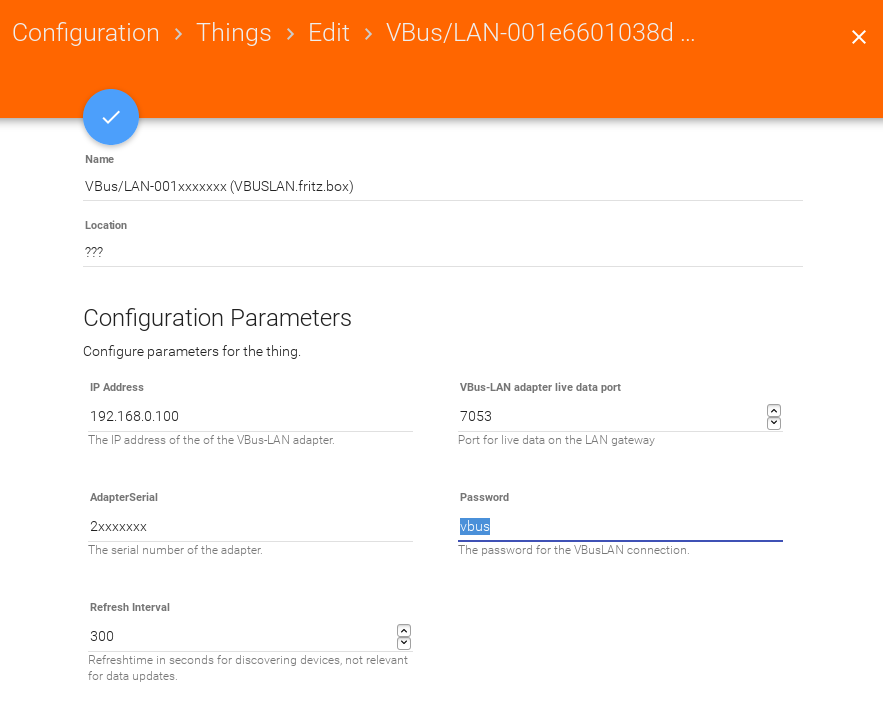
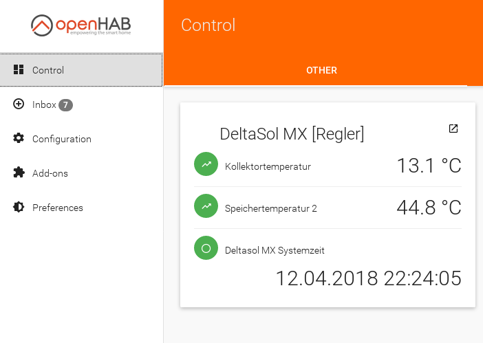

# Getting Started

There are different ways to setup the binding, this getting started guide assumes you are using the Paper UI. Installing the binding can be done either via the Eclipse IoT Marketplace or manually by placing the jar in the file system.

## Installation via IoT Marketplace

A prerequisite here is to have the misc addon "Eclipse IoT Market" installed:

Then seach for the resol binding and install it:

## Installation via file system

Download the latest jar from the [github repository](https://github.com/ramack/openhab2-addons/tree/BETA-1/addons/binding/org.openhab.binding.resol/target) and put it into the addons folder, usually in /usr/share/openhab2/addons/

# Add and configure a VBUS Bridge

Select 'Configuration/Things' and press the + for adding new things.

Select 'Resol Binding'

Wait...
and if everything goes smooth you should get the popup that a new thing was added to your inbox.

Select that one to add it as thing and configure it:

It should normally be sufficient to set the password. If 'vbus' works you should consider changing the password of the Resol device...

After that the thing state should go to online and a some new things should popup in your inbox:

# Add and configure Resol Devices

Depending on the solar/heating controller you have attached to your VBUS there will be a "controller" and several other things like heat quantity meters, heating circuit controls, etc. Add whether you are interested in in a similar manner as things.

Those you can edit and link channels manually there, if you don't have 'simple mode' for item linking on. (In that case you are already done.)

# Result
In the Control section of the Paper UI you now should see all the items you linked.

